# Maintenance

## Maintenance Plans
A maintenance plan defines the maintenance tasks, materials and resources required to carry out scheduled maintenance on a fixed asset. The schedule may be based on time intervals, say every 6 months, or on usage, for example kilometres or running hours.

The plan acts as a template to generate maintenance orders, to carry out a particular maintenance instance on the asset.  The plan is typically linked to a *maintenance group* and a *maintenance plan type*.

A single asset may have multiple maintenance plans. For example, a passenger vehicle with a petrol engine will typically have a plan for minor services, and a plan for major services.

A maintenance plan may be applied to any number of similar assets

**Create a New Maintenance Plan**
From the Asset Management role centre, select 'Maintenance Plans', or use the search button. The list of active maintenance plans will be displayed.

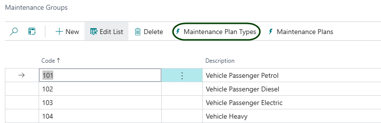

Click on New. The Maintenance Plan Card will open.

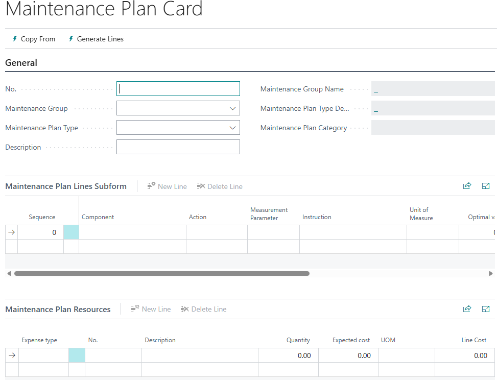

Press Tab to move past the No. field. A plan number will be assigned.

Select a Maintenance Group and a Maintenance Plan Type from the available lists. The descriptions will be updated.

**Capture the maintenance lines to record the actions that will be taken as follows:**
The tasks captured on the plan should include all standard or recommended tasks that should be suggested when actioning a maintenance order derived from the plan. The tasks can be amended on the maintenance order.

| **Column** | **Value** |
|-|-|
|Component|Specify the area of the asset that the action applies to |
|Action|Select or enter an action, for example 'Check', 'Adjust' |
|Measurement parameter|Where a quantifiable measurement is being taken, select the measure from the available options|
|Instruction |The system will generate an instruction from the choices selected. Amend if required.|
|Optimal value||
|Tolerance 1||
|Tolerance 2||
|Tolerance 3||
|Comments||

Example:
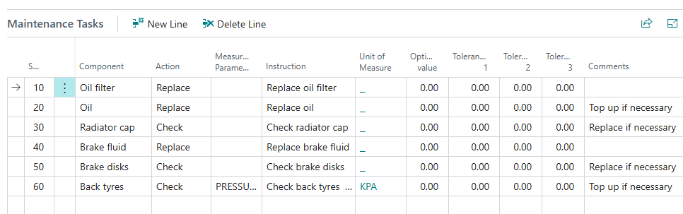

**Capture the materials and resources required to carry out the tasks on the maintenance plan:**
Capture the recommended consumables and spares, resources, or other expenses that will be required to action a maintenance order derived from the maintenance plan. Expenses can be added, removed or changed on the order. Actual consumption will be captured per order.

| **Column** | **Value** |
|-|-|
|Expense Type|Select an option from the list - Item, Resource, Vendor, GL Account|
|No.|A lookup list will be presented, based on the Expense Type selected.|
|Description|Initially set to the name or description of the entity selected|
|Quantity||
|Expected Cost|
|UOM|Unit of measure code|

Example:
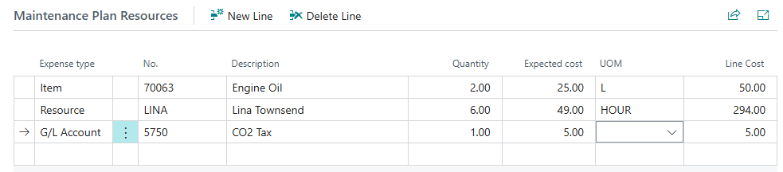

## Maintenance Orders
Maintenance orders are work instructions to carry out a specific set of maintenance tasks on a fixed asset. Maintenance orders can be generated from a maintenance plan, or can be created as needed for unplanned maintenance. They can also be generated from a defect register entry.

**Create a new order**
Option 1: From the Braintree Asset Maintenance role centre, click on '+ Maintenance Order':

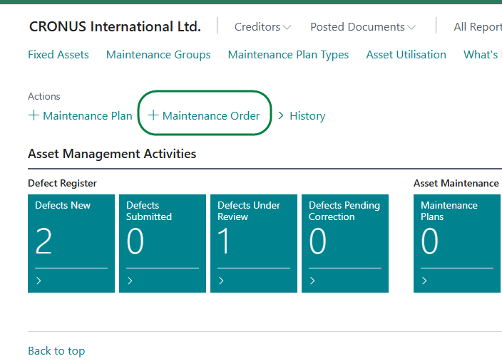

Option 2: Open the Maintenance Orders list, and click on New. 

The Maintenance Order card will be opened.

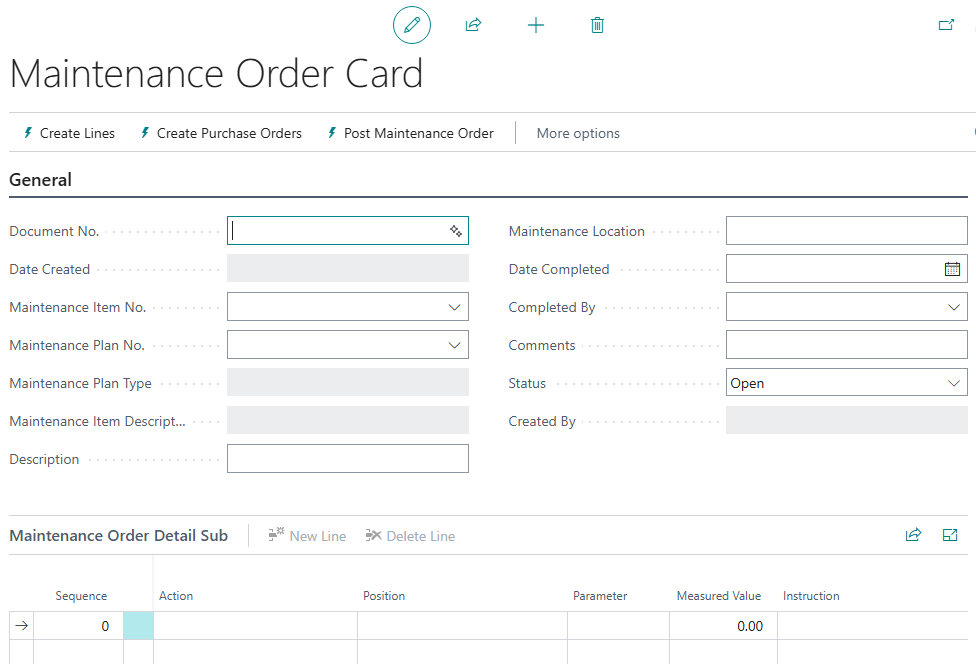

Tab past the document number. The system will assign a new number from the number series.

Select the maintenance item number (asset number) from list.

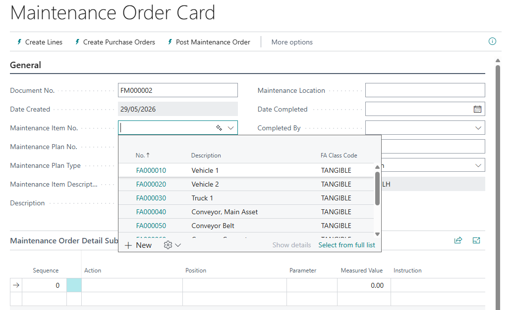

If the maintenance order is to be based on a maintenance plan.

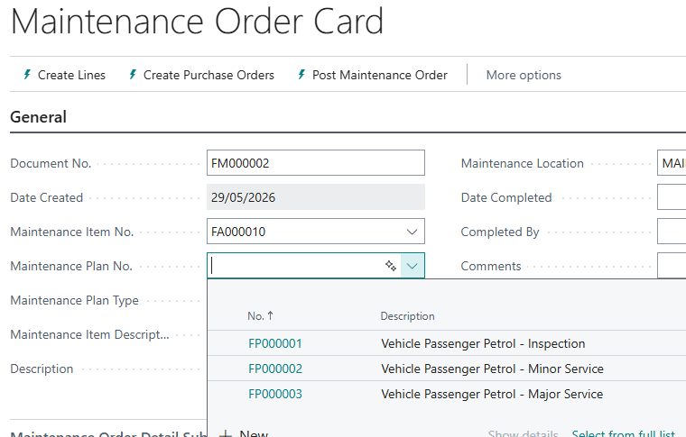

The description fields, maintenance type, and maintenance location will be populated.

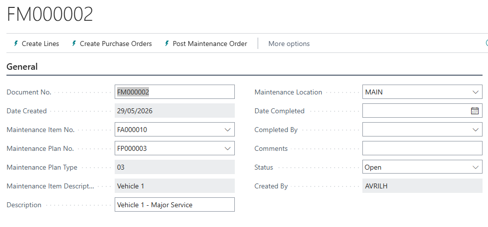

If the order is based on a maintenance plan, click on the menu option 'Create Lines'. 

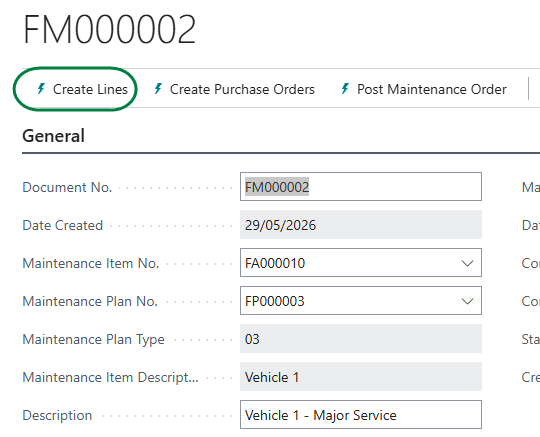

The tasks and resources will be copied from the maintenance plan to the order:

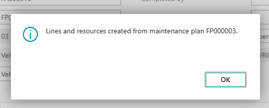

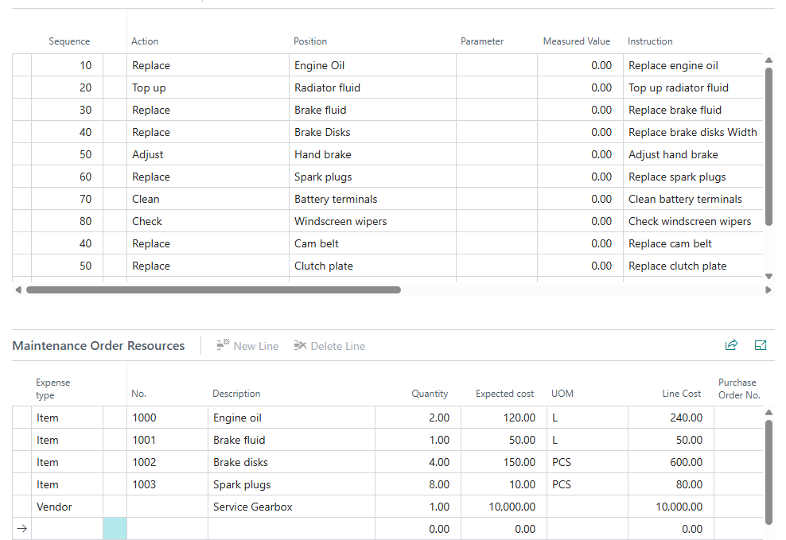

You can add, remove or amend any of the tasks or resources as required.

When you have completed the order details, release the order.

## Purchase Orders

## Maintenance Register

## Maintenance Ledger

