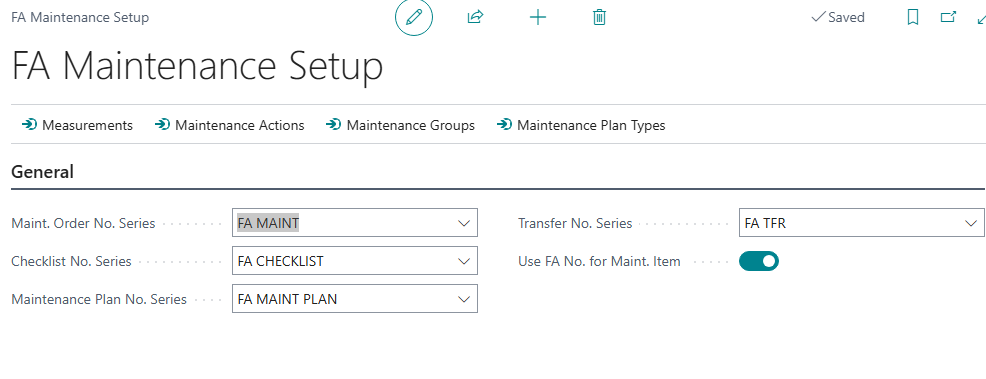
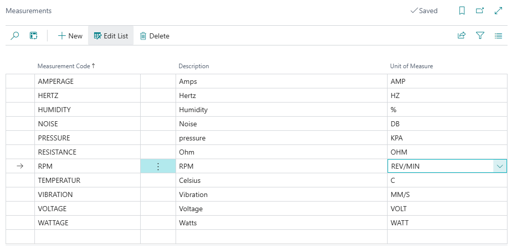
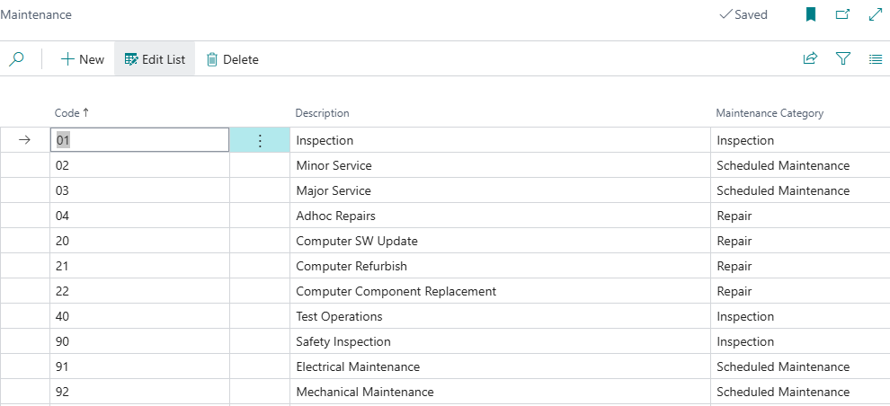
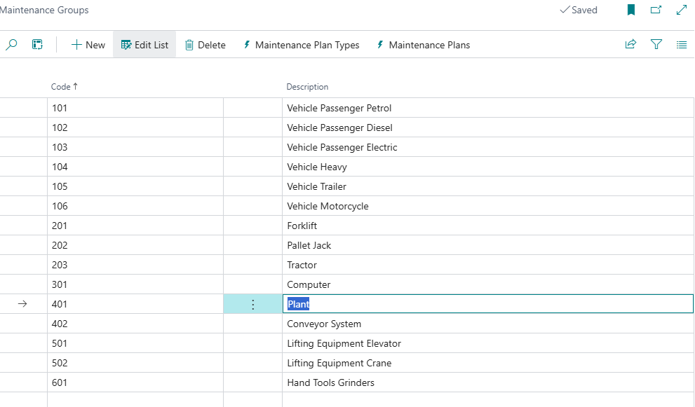
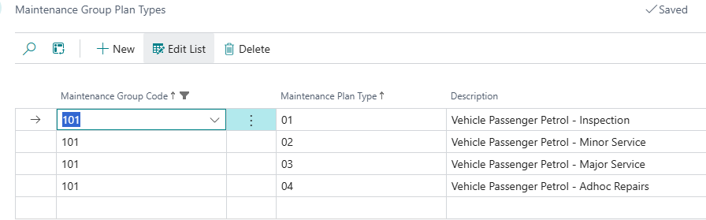

# Setup and Configuration

## Fixed Assets Maintenance Setup
Search for 'FA Maintenance Setup', or select 'Maintenance Setup' from the Fixed Assets Setup page.

On installation, number series will be created for
- Maintenance plans
- Maintenance orders
- Checklists
- Transfers

You can amend these if required.

## Definitions

| Column | Content|
|----------|----------|

## Measurements
From FA Maintenance Setup, select 'Measurements'.
From the Measurements list, add or edit the entries. 

Example:

## Maintenance Actions
From FA Maintenance Setup, select 'Maintenance Actions'.
From the Maintenance Actions list, add or edit the entries.

    Note: it is not necessary to predefine all actions. They can be dynamically added during creation of maintenance plans.

## Maintenance Plan Types
Maintenance plan types define broad categories of maintenance, for example inspection, minor service, major service, safety compliance.

From FA Maintenance Setup, select 'Maintenance Plan Types'.
From the Maintenance Plan Types list, add or edit the entries:

Enter a code and description, and select a maintenance category from the available list.

## Maintenance Groups
Maintenance groups are used to group a set of fixed assets together, based on common properties. The group can be used to associate typical maintenance activities with specific assets.

Example: 
Motor vehicles can be split by size and fuel type - Passenger Petrol, Passenger Diesel.

From FA Maintenance Setup, select 'Maintenance Groups'.
From the Maintenance Groups list, add or edit the entries:

### Maintenance groups - Plan types
You can associate plan types with maintenance groups. Select 'Maintenance Plan Types' from the Maintenance Groups page.

| **Term** | **Definition** |
|---|---|
|Measurements|Defines key measurements taken as part of maintenance and inspections. |
|Maintenance Actions|Defines actions that are used in maintenance activities, for example Check, Top up, Adjust|
|Maintenance Group|Defines a group for which common maintenance activities apply, for example Passenger Vehicles, Motorcycles, Fridges|
|Maintenance Plan Types|Defines categories of maintenance plans, for example Minor Service, Safety Certification|
|Maintenance Plans|Defines a set of standard activities and resource requirements for the maintenance of a particular group of assets|
|Maintenance Order|Defines specific maintenance actions|
|Checklist||
|Defect Register ||